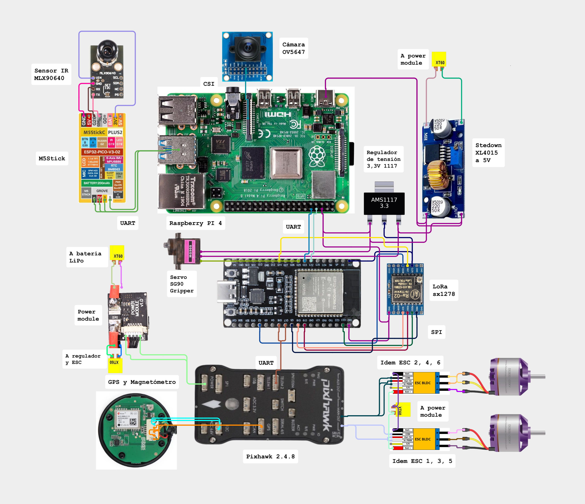
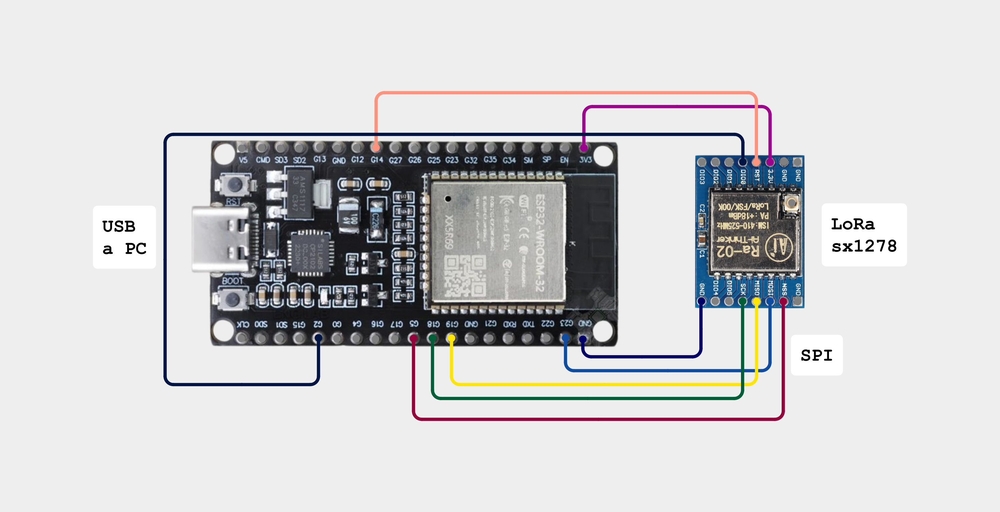

# Universidad Nacional de Lomas de Zamora – Facultad de Ingeniería

## Desarrollo de un dron multirrotor con detección térmica e inteligencia artificial embarcada

---

## Introducción / Objetivo

En la Universidad Nacional de Lomas de Zamora, la Facultad de Ingeniería se dedica a la formación de profesionales en diversas ramas de la ingeniería. Este repositorio corresponde al proyecto desarrollado en el área de **Ingeniería Mecatrónica**, como parte del **Proyecto Final de Carrera**.

El objetivo de este proyecto es el **diseño, construcción e integración de un vehículo aéreo no tripulado (UAV) multirrotor**, capaz de ejecutar misiones autónomas de búsqueda mediante **sensado térmico, visión RGB e inteligencia artificial embarcada**, con transmisión de eventos a una estación de control terrestre.

El proyecto busca demostrar la **viabilidad técnica** de una plataforma de bajo costo orientada a tareas de detección temprana, priorizando estabilidad, confiabilidad y modularidad del sistema.

---

## Índice

- Descripción  
- Instrucciones de Uso  
- Tecnologías Utilizadas  
- Listado de Componentes  
- Esquemáticos  
- Fotos / Videos
- Carpetas del Proyecto  
- Autor  
 

---

## Descripción

Este proyecto se basa en el desarrollo de un **dron multirrotor tipo hexacóptero**, diseñado para realizar misiones autónomas de búsqueda y detección de eventos térmicos y visuales.

El sistema integra:

- Una **plataforma aérea** controlada por un piloto automático (Pixhawk comandado por un ESP32).
- Un **sistema de detección embarcado** basado en Raspberry Pi, encargado del procesamiento de imágenes RGB y térmicas mediante algoritmos de inteligencia artificial.
- Un **microcontrolador ESP32** que actúa como integrador del sistema, coordinando las comunicaciones entre los distintos subsistemas.
- Un enlace de **comunicación LoRa** para la transmisión de eventos relevantes hacia una estación base (*Estación Terrestre*).

La estación terrestre permite definir misiones, visualizar la trayectoria del dron y recibir notificaciones de eventos detectados, incluyendo su localización geográfica.

---

## Instrucciones de Uso

Para utilizar este proyecto, seguir los siguientes pasos generales:

**Paso 1:** Configurar y cargar el firmware correspondiente en el ESP32 y en la controladora de vuelo.

**Paso 2:** Preparar la Raspberry Pi con el sistema operativo y las dependencias necesarias para el procesamiento de imágenes y ejecución de los modelos de IA.

**Paso 3:** Conectar los sensores (cámara RGB y sensor térmico) y verificar su correcto funcionamiento.

**Paso 4:** Ejecutar la aplicación de la Estacion Terrestre desde una computadora en entorno Jupyter, estableciendo la comunicación con el dron mediante el adaptador USB - LoRa.

**Paso 5:** Definir una misión, cargarla en el sistema y realizar las pruebas de vuelo en un entorno controlado.

Asegurarse de contar con los componentes, herramientas y configuraciones detalladas en las secciones siguientes.

---

## Tecnologías Utilizadas

Este proyecto fue desarrollado utilizando las siguientes tecnologías:

### Robótica
- Controladores de vuelo para UAV (Pixhawk)
- Motores brushless y servomotores
- Plataforma multirrotor tipo hexacóptero

### Electrónica
- ESP32
- Sensor térmico (MLX90640)
- Cámara RGB (OV5647)
- Módulos de comunicación LoRa (SX1278)
- Controladores electrónicos de velocidad (ESC)

### Programación
- Python
- C / C++
- Scripts de control y procesamiento

### Plataformas
- MAVLink
- OpenCV
- ONNX Runtime

### Inteligencia Artificial
- Redes neuronales convolucionales
- YOLOv8 para detección de personas, fuego y humo
- Procesamiento de visión por computadora

---

## Listado de Componentes

- Controladora de vuelo Pixhawk
- 6 x ESC de 30 A
- 6 x Motores brushless 2816
- 6 x Hélices 8x4.5 (3 giro derecho y 3 giro izquierdo)
- Batería LiPo 3S 5000 mAh
- Fuente step down XL4015 a 5V
- Microcontrolador ESP32
- Módulo LoRa SX1278
- Servo sg90
- Raspberry Pi  
- Sensor térmico MLX90640  
- Cámara RGB OV5647  
- Chasis impreso en 3D
- 6 x Brazos aluminio portamotores

Para el adaptador USB - LoRa de la base:
- Microcontrolador ESP32
- Módulo LoRa SX1278

---

## Esquemáticos

A continuación se presentan los esquemáticos y diagramas de diseño del sistema:

![Diagrama en bloques ESP32 dron] (Pixhawk/Diagrama dron.png)

 
![Diagrama en bloques adaptador USB_LoRa] (Adaptador UART-LoRa/Diagrama puente.png)

---

## Fotos / Videos

En esta sección se incluyen imágenes y videos correspondientes al desarrollo y funcionamiento del proyecto:

- Fotografías del dron ensamblado  
- Imágenes de pruebas de vuelo  
- Capturas de la Ground Station en funcionamiento  
- Videos demostrativos de detección de eventos  

(Los archivos multimedia se encuentran disponibles en la carpeta **MULTIMEDIA**).

---

## Autor

Este proyecto fue realizado por **Ignacio Fernández Malenotti** como parte de la carrera de **Ingeniería Mecatrónica** en la Facultad de Ingeniería de la Universidad Nacional de Lomas de Zamora.

---

## Carpetas del Proyecto

La estructura del repositorio es la siguiente:

- **CODIGO:** Código fuente del sistema (ESP32, Raspberry Pi y Ground Station).  
- **MULTIMEDIA:** Imágenes y videos del desarrollo y pruebas.  
- **PLANOS:** Esquemáticos, diagramas y vistas de diseño.  
- **DATASHEET:** Hojas de datos de los componentes utilizados.  
- **INFORMES:** Documentación técnica, informes, cronogramas y material académico relacionado.

